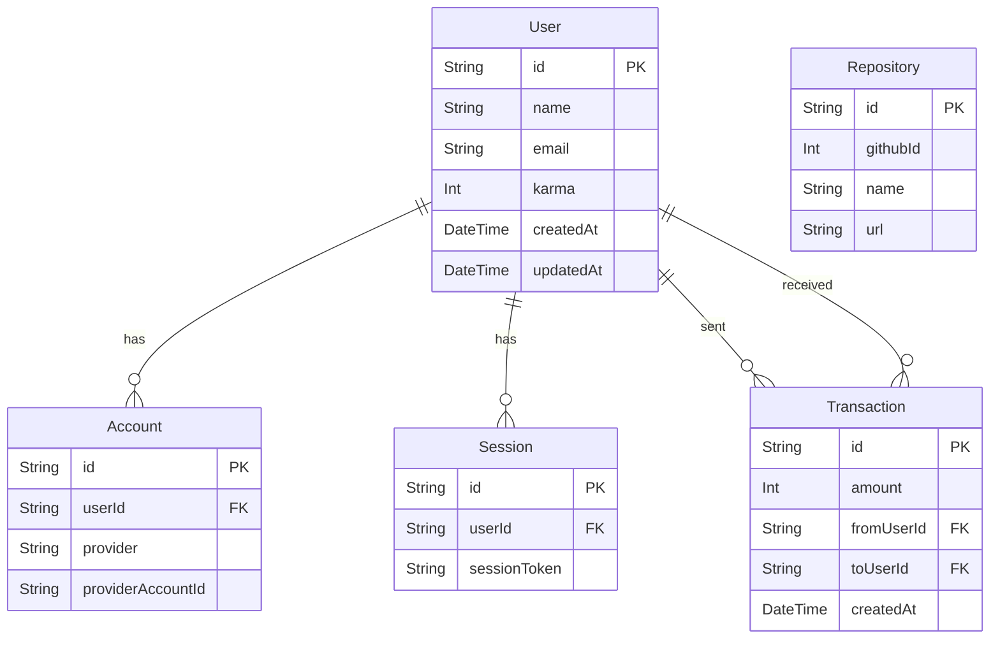

# Database Schema

We use PostgreSQL as our primary database and Prisma as our ORM.
To ensure stability in serverless environments (Vercel) and support migrations, we use a **Dynamic Connection Strategy**.

## Connection Strategy

*   **Runtime (`DATABASE_URL`)**: Uses the Transaction Pooler (e.g., Supabase port 6543) for high concurrency.
*   **Migration (`DIRECT_URL`)**: Uses the Direct Connection (e.g., Supabase port 5432) for schema changes.

This is handled automatically in `prisma.config.ts` and the `npm run migrate` script.

## ER Diagram

## Key Models

### User
The central entity. Stores profile information and current Karma balance.
- `karma`: The user's current karma points (default 0).

### Transaction
Records the flow of Karma between users.
- `fromUser`: The user giving Karma.
- `toUser`: The user receiving Karma.
- `amount`: The amount of Karma transferred.

### Repository
Stores information about GitHub repositories registered on the platform.
