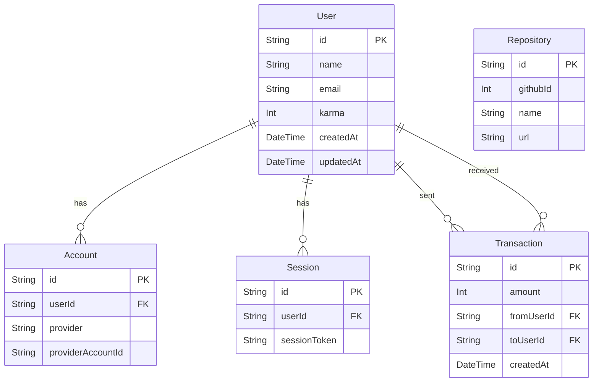

# Database Schema

We use PostgreSQL as our primary database and Prisma as our ORM.
To ensure stability in serverless environments (Vercel) and support migrations, we use a **Dynamic Connection Strategy**.

## Connection Strategy

*   **Runtime (`DATABASE_URL`)**:
    *   **Prod**: Transaction Pooler (Supabase Cloud port 6543).
    *   **Local**: Supabase Local (Docker port 54322).
*   **Migration (`DIRECT_URL`)**:
    *   **Prod**: Direct Connection (Supabase Cloud port 5432).
    *   **Local**: Direct Connection (Supabase Local port 54322).

This is handled by:
- `npm run migrate` (for Prod/Remote)
- `npm run migrate:local` (for Local)

## ER Diagram

## Key Models

### User
The central entity. Stores profile information and current Karma balance.
- `karma`: The user's current karma points (default 0).

### Transaction
Records the flow of Karma between users.
- `fromUser`: The user giving Karma.
- `toUser`: The user receiving Karma.
- `amount`: The amount of Karma transferred.

### Repository
Stores information about GitHub repositories registered on the platform.
